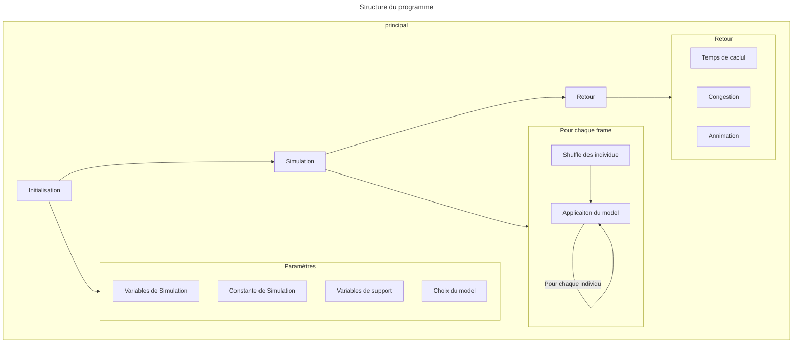
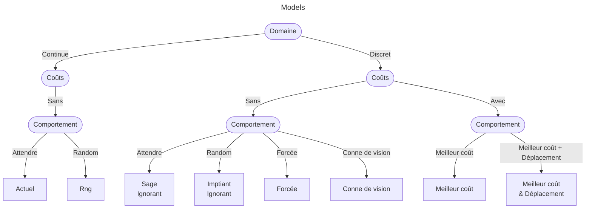

# Simulation de foule avec CUDA

Ce *README* servira davantage de feuille de route/journal de bord qu'un README classique. Les quelques documents pouvant être utiles seront tout de même répertoriés ici.

## Table des matières

- [Simulation de foule avec CUDA](#simulation-de-foule-avec-cuda)
  - [Table des matières](#table-des-matières)
  - [Fichier Utiles](#fichier-utiles)
  - [Introduction du sujet](#introduction-du-sujet)
  - [Structure du programme](#structure-du-programme)
    - [Rendu](#rendu)
  - [Installation](#installation)
    - [Installation de CUDA](#installation-de-cuda)
    - [Installation de HDF5](#installation-de-hdf5)
    - [OpenCV](#opencv)
  - [Utilisation](#utilisation)
  - [Liste des tâches à effectuer](#liste-des-tâches-à-effectuer)
    - [Organisation](#organisation)

## Fichier Utiles

- [Pointage](markdown/pointage.md)
- [Journal de bord](markdown/journal_de_bord.md)

## Introduction du sujet

Lors de la réunion de début de stage (01-06-2023), le projet de stage et de simulation a été présenté de la manière suivante :

L'objectif est de simuler une foule en 2D en utilisant des modèles physiques existants. Cependant, il est nécessaire de paralléliser autant que possible la simulation en utilisant CUDA dans un premier temps.

- Étude de modèles de foule -> Théorie mathématique
  - Congestion du trafic routier
  - Simulations principalement réalisées avec ***MatLab***, ce qui limite l'optimisation des calculs et n'autorise aucune parallélisation.
  - La taille de la population influence la qualité des résultats. Plus elle est importante, plus les résultats sont intéressants.
- Simulation uniquement en 2D
- Plusieurs façons de procéder avec de nombreux modèles mathématiques

> Il existe des simulations basées sur des particules pour cela, mais nous n'utiliserons pas ces modèles.

- Nous optons pour un fonctionnement basé sur une grille (avec des "roomels" - éléments de la pièce - d'une dimension de 1, mais cela n'a pas d'importance).
  - Chaque roomel ne peut contenir qu'une seule personne et elles ne peuvent pas se comprimer.
  - Dans un premier temps, nous avons une distribution aléatoire d'individus dans la pièce.
  - Les individus ont pour objectif de sortir de la pièce et **ils se déplacent tous à la même vitesse**.

Lors du déplacement, il peut y avoir des situations problématiques, si une personne est déjà présente sur la case, ou si on rencontre un mure. Il faut donc prévoire ces cas.

- Ne rien faire.
- Prendre une case voisine au hasard.
- Prendre la case voisine la plus proche.

> Même si, dans la vraie vie, nous avons tendance à privilégier les personnes les plus proches de la sortie.

Pour le mélange, nous pouvons mélanger un tableau d'indices pointant vers les individus.

## Structure du programme

Le programme se divise en trois étapes principales : l'initialisation, la simulation et le retour. Au sein de la simulation, plusieurs sous-étapes sont réalisées à chaque frame, telles que le mélange des individus et l'application du modèle. Le programme comporte également des paramètres de simulation, des constantes de simulation et des variables de support. Le choix du modèle dépend de plusieurs paramètres, tels que le domaine (continu ou discret), l'utilisation d'un arbre de coûts et le comportement vis-à-vis des obstacles. Différents modèles sont disponibles, tels que l'actuel, le "sage ignorant", le RNG, l'impatient ignorant, le meilleur coût, le meilleur coût avec déplacement forcé et le conne de vision. Le coût peut être calculé en effectuant une inondation à partir de la sortie, et un balayage en deux passes permet d'obtenir un coût optimal. Les individus choisiront donc une case voisine ayant un coût inférieur ou égal.

---



---



---


### Rendu

Le rendu final n'est pas une priorité. Nous pourrions générer des fichiers binaires qui seront lus par un programme **Processing** pour produire des images ou des vidéos. Le programme doit être modifiable à l'aide de fichiers de configuration au format JSON. Nous devons également pouvoir récupérer des données de sortie (tableau de fichiers binaires).

## Installation

### Installation de CUDA

Pour linux :

```bash
apt install nvidia-cuda-toolkit
```

Puis avec CMake nous allons généré le projet.

```bash
cmake .
make
```

Dans un premier temps, j'ai commencé par créer un programme qui implémente ce que nous avons décrit, mais uniquement en utilisant le CPU. La documentation détaillée de ce programme est disponible dans le fichier [onlyCPU.md](markdown/onlyCPU.md).

Cepandant dans un premier temps vous pouvez essayer le programme `onlyCPU` sur votre propre machine. Elle doit néanmoins être équipé d'un terminal et de bach.

### Installation de HDF5

La bibliothèque HDF5 (Hierarchical Data Format 5) est utilisée pour stocker et organiser de grandes quantités de données de manière efficace et structurée. Elle offre des fonctionnalités avancées telles que la compression des données, l'indexation, la gestion des métadonnées et la possibilité de travailler avec des ensembles de données hiérarchiques. HDF5 est largement utilisée dans le domaine de la science, de la recherche et de l'analyse de données pour gérer et échanger des données complexes, volumineuses et multidimensionnelles, offrant une solution flexible et performante pour le stockage et la manipulation de données. Elle est utilisé dans ce projet pour exporter chaque frames de la simulation en perdant le moins de temps possible.

Pour installer HDF5 sur Ubuntu, vous pouvez suivre les étapes suivantes :

1. Mettez à jour les référentiels de packages en exécutant la commande suivante :
  
   ```bash
   sudo apt update
   ```

2. Installez le package HDF5 en utilisant la commande suivante :

   ```bash
   sudo apt install libhdf5-dev
   ```

3. Une fois l'installation terminée, vous pouvez vérifier la version installée en exécutant la commande suivante :

  ```bash
  h5cc -showconfig
  ```

   Cette commande affichera les informations sur la bibliothèque HDF5 installée, y compris sa version. La version minimale requise est la 1.10.x.

### OpenCV

Pour installer OpenCV sur Ubuntu, vous pouvez suivre les étapes suivantes :

1. Mettre à jour les paquets existants :

   ```bash
   sudo apt update
   ```

2. Installer les dépendances nécessaires à OpenCV :

   ```bash
   sudo apt install build-essential cmake git libgtk2.0-dev pkg-config libavcodec-dev libavformat-dev libswscale-dev
   ```

3. Installer les bibliothèques et les outils de développement spécifiques à l'image et à la vidéo :

   ```bash
   sudo apt install libjpeg-dev libpng-dev libtiff-dev libv4l-dev libxvidcore-dev libx264-dev libatlas-base-dev
   ```

4. Accéder au répertoire OpenCV du projet:

5. Créer un répertoire de construction :

   ```bash
   mkdir build
   cd build
   ```

6. Générer les fichiers de configuration CMake :

   ```bash
   cmake ..
   ```

7. Compiler les sources :

   ```bash
   make -j$(nproc)
   ```

8. Installer OpenCV sur votre système :

   ```bash
   sudo make install
   ```

Une fois ces étapes terminées, OpenCV sera installé sur votre système Ubuntu. Vous pouvez maintenant utiliser la bibliothèque OpenCV dans vos projets C++ en incluant les en-têtes nécessaires et en liant les bibliothèques lors de la compilation.

Attention il faut le codec gif :

1. Ouvrez un terminal.

2. Mettez à jour les packages disponibles en exécutant la commande suivante :

   ```bash
   sudo apt update
   ```

3. Installez le paquet `ffmpeg` qui contient le codec nécessaire pour le format GIF :

   ```bash
   sudo apt install ffmpeg
   ```

Une fois l'installation terminée, le codec GIF devrait être installé sur votre système Ubuntu, et OpenCV devrait être capable d'encoder les fichiers GIF correctement.

## Utilisation

Documenté dans les dossier :

- [Programme CPU](src/cpu)
- [Programme GPU](src/gpu)

## Liste des tâches à effectuer

### Organisation

- [x] Réalisation du fichier README.md
- [x] Explication du projet
- [x] Refaire le fichier  [`gitignore`](.gitignore) de manière approp
- [x] Créer un fichier Makefile.
- [ ] finir les export au propre (image)
- [ ] liste d'attente de chaque individu
- [ ] gestion des murs
- [ ] carte des couts
- [ ] mettre en place un nouveau model (model avec calcul de distance des case voisines les plus proche)
- [ ] parsseur d'images pour la création d'une map
- [ ] version "mac" CPU
