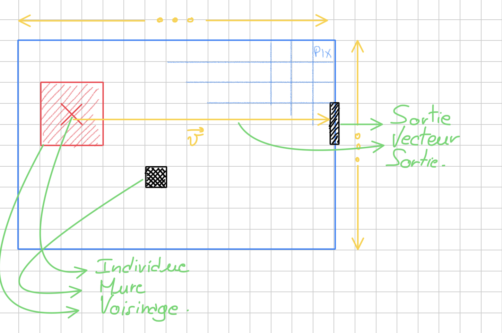

# Simulation de foule avec CUDA

Ce *README* servira davantage de feuille de route/journal de bord qu'un README classique. Les quelques documents pouvant être utiles seront tout de même répertoriés ici.

**Table des matières**

- [Simulation de foule avec CUDA](#simulation-de-foule-avec-cuda)
  - [Introduction du sujet](#introduction-du-sujet)
    - [Rendu](#rendu)
    - [Utilisation de CUDA](#utilisation-de-cuda)
    - [Makefile](#makefile)
    - [Pour aller plus loin](#pour-aller-plus-loin)
  - [Installation](#installation)
  - [Utilisation](#utilisation)
  - [Liste des tâches à effectuer](#liste-des-tâches-à-effectuer)
  - [Journal de bord](#journal-de-bord)
    - [2023-06-01](#2023-06-01)
    - [2023-06-02](#2023-06-02)

## Introduction du sujet

Lors de la réunion de début de stage (01-06-2023), le projet de stage et de simulation a été présenté de la manière suivante :

L'objectif est de simuler une foule en 2D en utilisant des modèles physiques existants. Cependant, il est nécessaire de paralléliser autant que possible la simulation en utilisant CUDA dans un premier temps.

- Étude de modèles de foule -> Théorie mathématique
    - Congestion du trafic routier
    - Simulations principalement réalisées avec ***MatLab***, ce qui limite l'optimisation des calculs et n'autorise aucune parallélisation.
    - La taille de la population influence la qualité des résultats. Plus elle est importante, plus les résultats sont intéressants.
- Simulation uniquement en 2D
- Plusieurs façons de procéder avec de nombreux modèles mathématiques

> Il existe des simulations basées sur des particules pour cela, mais nous n'utiliserons pas ces modèles.

- Nous optons pour un fonctionnement basé sur une grille (avec des "roomels" - éléments de la pièce - d'une dimension de 1, mais cela n'a pas d'importance).
  - Chaque roomel ne peut contenir qu'une seule personne et elles ne peuvent pas se comprimer.
  - Dans un premier temps, nous avons une distribution aléatoire d'individus dans la pièce.
  - Les individus ont pour objectif de sortir de la pièce et **ils se déplacent tous à la même vitesse** en calculant et en suivant le vecteur position.

Lors du déplacement, il peut y avoir des situations problématiques :
- Si une personne est déjà présente sur une case :
    - Ne rien faire.
    - Prendre une case voisine au hasard.
    - Prendre la case voisine la plus proche.

Problème potentiel lors de la parallélisation :
- Plusieurs écritures sur une même case, nécessitant l'utilisation d'opérations atomiques.
- Il est nécessaire de mélanger les individus pour ne pas privilégier certains et éviter l'apparition d'artefacts.
> Même si, dans la vraie vie, nous avons tendance à privilégier les personnes les plus proches de la sortie.

Pour le mélange, nous pouvons mélanger un tableau d'indices pointant vers les individus.

### Rendu
Le rendu final n'est pas une priorité. Nous pourrions générer des fichiers binaires qui seront lus par un programme **Processing** pour produire des images ou des vidéos. Le programme doit être modifiable à l'aide de fichiers de configuration au format JSON. Nous devons également pouvoir récupérer des données de sortie (tableau de fichiers binaires).

### Utilisation de CUDA
Parallélisation des calculs pour chaque individu à l'aide de CUDA.

### Makefile
Je dois me renseigner sur le fonctionnement des fichiers Makefile.
Je ne pense pas qu'un Makefile soit utile pour le moment. Dans le pire des cas un ficher `bach` sera amplement suffisant.

### Pour aller plus loin
Nous avons un objectif de rendu.

## Installation
Dans un premier temps, j'ai commencé par créer un programme qui implémente ce que nous avons décrit, mais uniquement en utilisant le CPU. La documentation détaillée de ce programme est disponible dans le fichier [onlyCPU.md](markdown/onlyCPU.md).

## Utilisation
> À faire

## Liste des tâches à effectuer
**Organisation**
- [x] Réalisation du fichier README.md
- [x] Explication du projet
- [ ] Refaire le fichier  [`gitignore`](.gitignore) de manière appropriée au sujet du projet.

**Programmation**
- [x] Modéliser le problème. -> Schéma de ce document.
- [ ] Commencer par créer une version CPU du problème.

**Makefile**
- [ ] Créer un fichier Makefile.

## Journal de bord

### 2023-06-01
- **Matin** : Présentation du projet (1h15)
- **Après-midi** : Départ vers 18:45
  - [x] Mise en ordre des informations présentées le matin (partie introduction).
  - [x] Lecture sur le sujet de la simulation de foule.
  - [x] Recherche documentaire variée.
  - [x] Compréhension du domaine.

### 2023-06-02
- **Matin** : Arrivée à 8h/ Pause de 10:32->10:49 / fin à 12:18
  - [ ] Terminer la version utilisant uniquement le CPU.
  - [x] Corriger les fautes dans les documents *Markdown*.
  - [x] Ecrire les déspcritions des fonctions 
  - [x] Fin le la fonction `generatePopulation` dans [onlyCPU.cpp](src/onlyCPU.cpp)
- **Après-midi** : 13:00 - 16:30
  - [x] Ecriture de la doc pour la fonction `generatePopulation`
  - [x] Ecriture de la fonction `generateMap` dans [onlyCPU.cpp](src/onlyCPU.cpp)
  - [x] Ecriture de la fonction `shuffleIndex` dans [onlyCPU.cpp](src/onlyCPU.cpp)
  - [ ] Ecriture de la fonction `shifting` dans [onlyCPU.cpp](src/onlyCPU.cpp)
  - [ ] Ecriture de la fonction `generatesJsonFile` dans [onlyCPU.cpp](src/onlyCPU.cpp)
  - [ ] Ecriture de la fonction `printMap` dans [onlyCPU.cpp](src/onlyCPU.cpp)
  -  j'ai bien avancé sur l'ensemble de l'écriture du programme CPU. J'ai commencé à faire des fonctions qui me serviront de toute façon lors de la paraléllisation sur CUDA pour mieux voir ce qu'il se passe, comme `printMap`. 
  -  Je me suis rendu compte qu'il était impossible de se passer d'un tableau de des servant de carte pour pouvoir avoir une vision sur les voisins en direct sans avoir à repars courir tout le tableau des individus présents dans la simulation.