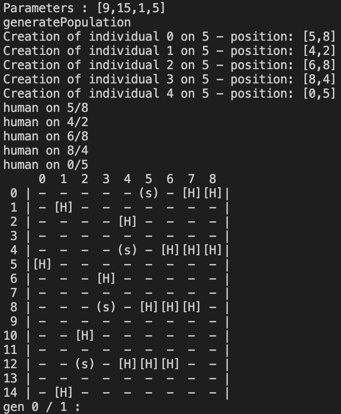

# Journal de bord

Retour au : [README](../README.md)
Retour au : [pointage](pointage.md)

## 2023-06-01

- **Matin** : Présentation du projet (1h15)
- **Après-midi** : 14:30 - 18:45
  - [x] Mise en ordre des informations présentées le matin (partie introduction).
  - [x] Lecture sur le sujet de la simulation de foule.
  - [x] Recherche documentaire variée.
  - [x] Compréhension du domaine.

## 2023-06-02

- **Matin** : 8:00 - 10:32 // 10:49 - 12:18
  - [x] Terminer la version utilisant uniquement le CPU.
  - [x] Corriger les fautes dans les documents Markdown.
  - [x] Écrire les descriptions des fonctions.
  - [x] Terminer la fonction `generatePopulation` dans [onlyCPU.cpp](src/onlyCPU.cpp).
- **Après-midi** : 13:00 - 16:30
  - [x] Écrire la documentation pour la fonction `generatePopulation` dans [onlyCPU.md](markdown/onlyCPU.md).
  - [x] Écrire la fonction `generateMap` dans [onlyCPU.cpp](src/onlyCPU.cpp).
  - [x] Écrire la fonction `shuffleIndex` dans [onlyCPU.cpp](src/onlyCPU.cpp).
  - [x] Écrire la fonction `shifting` dans [onlyCPU.cpp](src/onlyCPU.cpp).
  - [ ] Écrire la fonction `generatesJsonFile` dans [onlyCPU.cpp](src/onlyCPU.cpp).
  - [x] Écrire la fonction `printMap` dans [onlyCPU.cpp](src/onlyCPU.cpp).
  - J'ai bien avancé sur l'ensemble de l'écriture du programme CPU. J'ai commencé à faire des fonctions qui me serviront de toute façon lors de la parallélisation sur CUDA pour mieux voir ce qu'il se passe, comme `printMap`.
  - Je me suis rendu compte qu'il était impossible de se passer d'un tableau de déservant de carte pour pouvoir avoir une vision sur les voisins en direct sans avoir à parcourir tout le tableau des individus présents dans la simulation.
- **Soir** 18:00 - 19:30
  - Je rencontre un problème, soit dans l'affichage de la carte, soit dans sa génération.
  - 
  - Je commence à me documenter sur l'affichage dynamique en ligne de commande dans un terminal. Je ne pense pas que ça soit vraiment utile.

## 2023-06-05

- **Matin** : Comme c'était lundi, j'ai travaillé toute la journée au collège.
- **Après-midi** :
- **Soir** :

## 2023-06-06

- **Matin** : De 8h05 à 11h45, j'ai effectué le débogage de la fonction `generateMap` et de la fonction `printMap` dans le fichier [onlyCPU.cpp](src/onlyCPU.cpp). J'ai également supprimé tous les passages de dimensions dans les fonctions pour simplifier le code, car j'ai réalisé que je pouvais simplement passer les tableaux et utiliser la fonction `sizeof()` pour obtenir les dimensions. Cependant, j'ai constaté que cette méthode ne fonctionne que pour les allocations non dynamiques, alors que j'utilise des allocations dynamiques.
- **Après-midi** : Je n'ai pas pu être présent pour des raisons personnelles, mais je prévois de rattraper cette absence ultérieurement.
- **Soir** :

## 2023-06-07

- **Matin** : De 8h00 à 11h30, j'ai configuré mon poste de travail pour ne plus avoir à développer sur ma machine personnelle. J'ai également finalisé le module "Shifting". Cependant, j'ai rencontré une difficulté : la fonction "Shifting" ne prend pas en compte la sortie des individus de la simulation. Lorsqu'une personne quitte la simulation, elle n'est plus affichée mais continue d'exister. Je suis en train de trouver une solution pour gérer cette situation...
- **Après-midi** : De 13h00 à 17h00, j'ai exploré deux options pour gérer la sortie des individus de la simulation. La première option consiste à les supprimer de la structure qui gère la population, ce qui réduirait la consommation de mémoire. La deuxième option consiste à stocker une position prédéfinie (par exemple, (-1, -1)) pour les individus sortants. J'ai opté pour la deuxième option, car elle est plus rapide à mettre en œuvre et ne nécessite pas l'ajout d'une notion d'identifiant dans le tableau de population. J'ai également effectué des améliorations sur les paramètres argc et argv pour les rendre plus propres. J'ai modifié la struct de position pour utiliser des valeurs en float, car lorsque le vecteur de déplacement est recalculé à chaque frame, un déplacement linéaire ne peut pas être affiché correctement. Enfin, j'ai converti tout le code du fichier [onlyCPU](../src/onlyCPU.cpp) pour utiliser `float ** positions` au lieu des types précédents. Il me reste encore à créer la fonction qui exporte les données au format `bin` et à effectuer des tests avec les murs, où l'individu devrait être bloqué lorsqu'il se trouve à côté d'un mur plutôt que de continuer à se déplacer.
- **Soir** :

## 2023-06-08

- **Matin** : Ce matin, j'ai mis au propre le fichier de pointage des horaires et du journal de bord. Ensuite, j'ai prévu de faire la documentation du programme `onlyCPU`, de réaliser les tests de toutes les dimensions intéressantes pour `onlyCPU`, et de créer un script Python pour effectuer des tests et enregistrer les temps d'exécution.
- **Après-midi** : Dans l'après-midi, j'ai discuté avec Chat GPT pour obtenir de l'aide. J'ai également réalisé que la façon dont je créais les humains n'était pas correcte, car il y avait une possibilité de doublons. J'ai compris qu'il était nécessaire de créer à la fois la liste des humains et la carte. J'ai effectué un changement de fonction pour créer le terrain et l'environnement de simulation de manière plus appropriée.
- **Soir** :

## 2023-06-09

- **Matin** : Ce matin, j'ai terminé la fonction qui permet d'exporter les données au format `.bin`. J'ai également installé WSL (Windows Subsystem for Linux) car j'ai rencontré des problèmes pour faire fonctionner Python et Jupyter sur Windows. En passant sous Linux, j'ai pu résoudre ces problèmes et bénéficier d'un terminal fonctionnel. J'ai également effectué des modifications dans la fonction d'exportation en `.bin` pour qu'elle range correctement les fichiers dans les dossiers appropriés. Enfin, j'ai réalisé un script de benchmark en Python.
- **Après-midi** : L'après-midi, j'ai récupéré une demi-journée de travail pour remplacer Louann, mais j'ai travaillé en télétravail. J'ai continué à travailler sur le programme de benchmark sur mon ordinateur personnel, et j'ai avancé pendant environ 1 heure et 30 minutes.
- **Soir** :

## 2023-06-12

Journée passée au collège.

- **Matin** :
- **Après-midi** :
- **Soir** :

## 2023-06-13

- **Matin** : Correction des fautes dans le programme et les documents .md.
- **Après-midi** : Malheureusement, j'ai été retenue au collège pour des raisons indépendantes de ma volonté. Cependant, j'ai pu consacrer une heure à des recherches et j'ai également repris la lecture de mon travail sur *CUDA* que j'ai réalisé cette année.
- **Soir** :

## 2023-06-14

- **Matin** : J'ai commencé la partie *CUDA*.
- **Après-midi** :
  - J'ai poursuivi le développement de la partie *CUDA*.
  - J'ai participé à une réunion avec M. Crespin et Ournidne.
  - J'ai pris le temps de réorganiser le contenu de la réunion.
- **Soir** : J'ai récupéré le projet CUDA que j'avais réalisé avec Théo.

## 2023-06-15

- **Matin** :
  - [x] J'ai mis au propre le compte rendu de la réunion.
  - J'ai commencé à travailler sur le fichier [main.cpp](../src/gpu/main.cpp).
- **Après-midi** :
  - [x] J'ai créé une fonction qui prend en charge les paramètres d'appel du programme et les modifie si nécessaire dans les fichiers [main.cpp](../src/gpu/main.cpp), [header](../src/gpu/main.hpp) et [functions](../src/gpu/function.cpp).
  - J'ai commencé à rédiger le fichier [withGPU.md](withGPU.md).
  - J'ai mis à jour les fichiers [Pointage](pointage.md) et [Read Me](../README.md).
- **Soir** :

## 2023-06-16

- **Matin** :
  - [x] J'ai ajouté les fonctions CPU à la version GPU.
  - [x] J'ai travaillé sur le fichier CMake.
- **Après-midi** :
  - J'ai continué ce que j'avais commencé le matin.
- **Soir** :

## 2023-06-19

- **Matin** :
  - J'ai consacré du temps à la lecture sur le sujet de la simulation de foule, en consultant les ressources suivantes :
    - <https://fr.wikipedia.org/wiki/Simulation_de_foule>
    - <https://www.theses.fr/2022UPASM035.pdf>
    - <https://images.math.cnrs.fr/Modelisation-de-mouvements-de-foules>
    - <https://theses.hal.science/tel-00346035v1/preview/these_venel.pdf>
  - Malheureusement, je n'ai pas réussi à trouver d'approche algorithmique spécifique à ce sujet.
- **Après-midi** :
- **Soir** :

## 2023-06-20

- **Matin** :
  - J'ai résolu les problèmes de dimensions de grille pour l'addition (limitée à <1024).
  - J'ai commencé à travailler sur le kernel pour le modèle simpliste, basé sur le code présent dans [onlyCPU.cpp](../src/cpu/onlyCPU.cpp).
- **Après-midi** :
  - J'ai effectué des améliorations sur le référentiel Git du projet.
  - J'ai mis à jour le fichier [gitignore](../.gitignore).
  - J'ai créé un fichier [src readme](../src/README.md).
  - J'ai créé un fichier [cpu readme](../src/cpu/README.md).
  - J'ai créé un fichier [gpu readme](../src/gpu/README.md).
  - J'ai progressé sur les fichiers [kernel.hpp](../src/gpu/kernel.hpp) et [kernel.cpp](../src/gpu/kernel.cu).
  - Je ne suis toujours pas satisfait du contenu du [readme](../README.md) principal du projet. Je sais qu'il faudra que je l'améliore davantage.
- **Soir** :

## 2023-06-21

- **Matin** :
- **Après-midi** :
- **Soir** :

## 2023-06-22

- **Matin** :
- **Après-midi** :
- **Soir** :

## 2023-06-23

- **Matin** :
- **Après-midi** :
- **Soir** :

## 2023-06-26

- **Matin** :
- **Après-midi** :
- **Soir** :

## 2023-06-27

- **Matin** :
- **Après-midi** :
- **Soir** :

## 2023-06-28

- **Matin** :
- **Après-midi** :
- **Soir** :

## 2023-06-29

- **Matin** :
- **Après-midi** :
- **Soir** :

## 2023-06-30

- **Matin** :
- **Après-midi** :
- **Soir** :

## 2023-07-03

- **Matin** :
- **Après-midi** :
- **Soir** :

## 2023-07-04

- **Matin** :
- **Après-midi** :
- **Soir** :

## 2023-07-05

- **Matin** :
- **Après-midi** :
- **Soir** :

## 2023-07-06

- **Matin** :
- **Après-midi** :
- **Soir** :

## 2023-07-07

- **Matin** :
- **Après-midi** :
- **Soir** :

## 2023-07-10

- **Matin** :
- **Après-midi** :
- **Soir** :

## 2023-07-11

- **Matin** :
- **Après-midi** :
- **Soir** :

## 2023-07-12

- **Matin** :
- **Après-midi** :
- **Soir** :

## 2023-07-13

- **Matin** :
- **Après-midi** :
- **Soir** :

## 2023-07-14

- **Matin** :
- **Après-midi** :
- **Soir** :

## 2023-07-17

- **Matin** :
- **Après-midi** :
- **Soir** :

## 2023-07-18

- **Matin** :
- **Après-midi** :
- **Soir** :

## 2023-07-19

- **Matin** :
- **Après-midi** :
- **Soir** :

## 2023-07-20

- **Matin** :
- **Après-midi** :
- **Soir** :

## 2023-07-21

- **Matin** :
- **Après-midi** :
- **Soir** :

## 2023-07-24

- **Matin** :
- **Après-midi** :
- **Soir** :

## 2023-07-25

- **Matin** :
- **Après-midi** :
- **Soir** :

## 2023-07-26

- **Matin** :
- **Après-midi** :
- **Soir** :

## 2023-07-27

- **Matin** :
- **Après-midi** :
- **Soir** :

## 2023-07-28

- **Matin** :
- **Après-midi** :
- **Soir** :

## 2023-07-31

- **Matin** :
- **Après-midi** :
- **Soir** :

## 2023-08-01

- **Matin** :
- **Après-midi** :
- **Soir** :

## 2023-08-02

- **Matin** :
- **Après-midi** :
- **Soir** :

## 2023-08-03

- **Matin** :
- **Après-midi** :
- **Soir** :

## 2023-08-04

- **Matin** :
- **Après-midi** :
- **Soir** :

## 2023-08-07

- **Matin** :
- **Après-midi** :
- **Soir** :

## 2023-08-08

- **Matin** :
- **Après-midi** :
- **Soir** :

## 2023-08-09

- **Matin** :
- **Après-midi** :
- **Soir** :

## 2023-08-10

- **Matin** :
- **Après-midi** :
- **Soir** :

## 2023-08-11

- **Matin** :
- **Après-midi** :
- **Soir** :

## 2023-08-14

- **Matin** :
- **Après-midi** :
- **Soir** :

## 2023-08-15

- **Matin** :
- **Après-midi** :
- **Soir** :

## 2023-08-16

- **Matin** :
- **Après-midi** :
- **Soir** :

## 2023-08-17

- **Matin** :
- **Après-midi** :
- **Soir** :

## 2023-08-18

- **Matin** :
- **Après-midi** :
- **Soir** :

## 2023-08-21

- **Matin** :
- **Après-midi** :
- **Soir** :

## 2023-08-22

- **Matin** :
- **Après-midi** :
- **Soir** :

## 2023-08-23

- **Matin** :
- **Après-midi** :
- **Soir** :

## 2023-08-24

- **Matin** :
- **Après-midi** :
- **Soir** :

## 2023-08-25

- **Matin** :
- **Après-midi** :
- **Soir** :

## 2023-08-28

- **Matin** :
- **Après-midi** :
- **Soir** :

## 2023-08-29

- **Matin** :
- **Après-midi** :
- **Soir** :

## 2023-08-30

- **Matin** :
- **Après-midi** :
- **Soir** :

## 2023-08-31

- **Matin** :
- **Après-midi** :
- **Soir** :

## 2023-09-01

- **Matin** :
- **Après-midi** :
- **Soir** :
