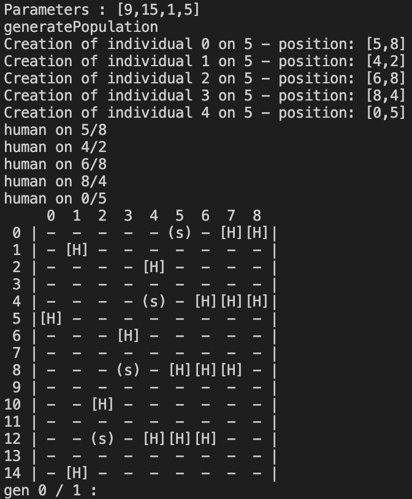

# Journal de bord

Retour au : [README](../README.md)
Retour au : [pointage](pointage.md)

## 2023-06-01

- **Matin** : Présentation du projet (1h15)
- **Après-midi** : 14:30 - 18:45
  - [x] Mise en ordre des informations présentées le matin (partie introduction).
  - [x] Lecture sur le sujet de la simulation de foule.
  - [x] Recherche documentaire variée.
  - [x] Compréhension du domaine.

## 2023-06-02

- **Matin** : 8:00 - 10:32 // 10:49 - 12:18
  - [x] Terminer la version utilisant uniquement le CPU.
  - [x] Corriger les fautes dans les documents Markdown.
  - [x] Écrire les descriptions des fonctions.
  - [x] Terminer la fonction `generatePopulation` dans [onlyCPU.cpp](src/onlyCPU.cpp).
- **Après-midi** : 13:00 - 16:30
  - [x] Écrire la documentation pour la fonction `generatePopulation` dans [onlyCPU.md](markdown/onlyCPU.md).
  - [x] Écrire la fonction `generateMap` dans [onlyCPU.cpp](src/onlyCPU.cpp).
  - [x] Écrire la fonction `shuffleIndex` dans [onlyCPU.cpp](src/onlyCPU.cpp).
  - [x] Écrire la fonction `shifting` dans [onlyCPU.cpp](src/onlyCPU.cpp).
  - [ ] Écrire la fonction `generatesJsonFile` dans [onlyCPU.cpp](src/onlyCPU.cpp).
  - [x] Écrire la fonction `printMap` dans [onlyCPU.cpp](src/onlyCPU.cpp).
  - J'ai bien avancé sur l'ensemble de l'écriture du programme CPU. J'ai commencé à faire des fonctions qui me serviront de toute façon lors de la parallélisation sur CUDA pour mieux voir ce qu'il se passe, comme `printMap`.
  - Je me suis rendu compte qu'il était impossible de se passer d'un tableau de déservant de carte pour pouvoir avoir une vision sur les voisins en direct sans avoir à parcourir tout le tableau des individus présents dans la simulation.
- **Soir** 18:00 - 19:30
  - Je rencontre un problème, soit dans l'affichage de la carte, soit dans sa génération.
  - 
  - Je commence à me documenter sur l'affichage dynamique en ligne de commande dans un terminal. Je ne pense pas que ça soit vraiment utile.

## 2023-06-05

- **Matin** : C'est un lundi donc j'ai travaillé toute la journée au collège.
- **Après-midi** :
- **Soir** :

## 2023-06-06

- **Matin** : 8:05 - 11:45
  - [x] Debug de la fonction `generateMap` dans [onlyCPU.cpp](src/onlyCPU.cpp).
  - [x] Debug de la fonction `printMap` dans [onlyCPU.cpp](src/onlyCPU.cpp).
  - [x] Retirer tous les passages de dimensions dans les fonctions pour simplifier le code, car je me suis rendu compte que je pouvais simplement me contenter de passer les tableaux et que la fonction `sizeof()` me donnait les dimensions.
  - Finalement non cette méthode ne foncitonne que pour les allocation non dynamique et je fait tout en dynamique.
- **Après-midi** : Je ne suis pas venu pour des raisons personnel, cette absence sera ratrapée.

## 2023-06-07

- **Matin** : 8:00 - 11:30
  - [x] Configuration du poste pour ne plus avoir à développer sur ma machine personnelle.
  - [x] Finalisation du module "Shifting".
  - Actuellement, la fonction "Shifting" ne prend pas en compte la sortie des individus. Lorsqu'une personne sort, elle n'est plus affichée, mais elle continue d'exister dans la simulation. Je suis confronté à la difficulté de gérer cette situation...
  
- **Après-midi** : 13:00 - 17:??
  - J'ai deux options lorsque l'individu quitte la simulation : soit le supprimer de la structure qui gère la population (ce qui réduit la consommation de mémoire), soit stocker une position prédéfinie (par exemple, (-1, -1)). J'ai opté pour la deuxième option, car elle est plus rapide à mettre en œuvre et ne nécessite pas l'ajout d'une notion d'identifiant dans le tableau de population.
  - [x] Faire des paramètres argc argv plus propre.
  - Quand on recalcule le vecteur déplacement à chaque frame on peux pas afficher un déplacement linéaire. Donc on à la struct de position qui passe en float
  - [x] Passer tout le code [onlyCPU](../src/onlyCPU.cpp) en ``float ** positions``
  - [ ] faire la fonction qui sort au format `bin`.
  - [ ] faire le test avec les mures (il teste une fois a coté sinon il reste là ou il est)

## 2023-06-08

- **Matin** :
  - [x] Mise au propre du fichier de poitage des horaires et du journal de bord.
  - [ ] Faire la doc du programme `onlyCPU`
  - [ ] Faire les teste de toutes les dimensions qui sont intérésante pour only CPU
  - [ ] Faire un script Python pour faire des tests et garder les temps d'execution.
- **Après-midi** : reprise à 14:28
  - j'ai parler avec Chat GPT pour qu'il m'aide
  - Je viens de me rendre compte que la fassons dont je créais les humain n'était pas bonne (possibilité de doublons). Il faut créer la liste ET la carte.
  - [x] Changement de fonction de création de terrain et d'environnemen de simulation qui est plus propre.
- **Soir** :

## 2023-06-09

- **Matin** :
  - [x] Finir la fonctiton qui exporte en `.bin`.
- **Après-midi** :
- **Soir** :

## 2023-06-12

- **Matin** :
- **Après-midi** :
- **Soir** :

## 2023-06-13

- **Matin** :
- **Après-midi** :
- **Soir** :

## 2023-06-14

- **Matin** :
- **Après-midi** :
- **Soir** :

## 2023-06-15

- **Matin** :
- **Après-midi** :
- **Soir** :

## 2023-06-16

- **Matin** :
- **Après-midi** :
- **Soir** :

## 2023-06-19

- **Matin** :
- **Après-midi** :
- **Soir** :

## 2023-06-20

- **Matin** :
- **Après-midi** :
- **Soir** :

## 2023-06-21

- **Matin** :
- **Après-midi** :
- **Soir** :

## 2023-06-22

- **Matin** :
- **Après-midi** :
- **Soir** :

## 2023-06-23

- **Matin** :
- **Après-midi** :
- **Soir** :

## 2023-06-26

- **Matin** :
- **Après-midi** :
- **Soir** :

## 2023-06-27

- **Matin** :
- **Après-midi** :
- **Soir** :

## 2023-06-28

- **Matin** :
- **Après-midi** :
- **Soir** :

## 2023-06-29

- **Matin** :
- **Après-midi** :
- **Soir** :

## 2023-06-30

- **Matin** :
- **Après-midi** :
- **Soir** :

## 2023-07-03

- **Matin** :
- **Après-midi** :
- **Soir** :

## 2023-07-04

- **Matin** :
- **Après-midi** :
- **Soir** :

## 2023-07-05

- **Matin** :
- **Après-midi** :
- **Soir** :

## 2023-07-06

- **Matin** :
- **Après-midi** :
- **Soir** :

## 2023-07-07

- **Matin** :
- **Après-midi** :
- **Soir** :

## 2023-07-10

- **Matin** :
- **Après-midi** :
- **Soir** :

## 2023-07-11

- **Matin** :
- **Après-midi** :
- **Soir** :

## 2023-07-12

- **Matin** :
- **Après-midi** :
- **Soir** :

## 2023-07-13

- **Matin** :
- **Après-midi** :
- **Soir** :

## 2023-07-14

- **Matin** :
- **Après-midi** :
- **Soir** :

## 2023-07-17

- **Matin** :
- **Après-midi** :
- **Soir** :

## 2023-07-18

- **Matin** :
- **Après-midi** :
- **Soir** :

## 2023-07-19

- **Matin** :
- **Après-midi** :
- **Soir** :

## 2023-07-20

- **Matin** :
- **Après-midi** :
- **Soir** :

## 2023-07-21

- **Matin** :
- **Après-midi** :
- **Soir** :

## 2023-07-24

- **Matin** :
- **Après-midi** :
- **Soir** :

## 2023-07-25

- **Matin** :
- **Après-midi** :
- **Soir** :

## 2023-07-26

- **Matin** :
- **Après-midi** :
- **Soir** :

## 2023-07-27

- **Matin** :
- **Après-midi** :
- **Soir** :

## 2023-07-28

- **Matin** :
- **Après-midi** :
- **Soir** :

## 2023-07-31

- **Matin** :
- **Après-midi** :
- **Soir** :

## 2023-08-01

- **Matin** :
- **Après-midi** :
- **Soir** :

## 2023-08-02

- **Matin** :
- **Après-midi** :
- **Soir** :

## 2023-08-03

- **Matin** :
- **Après-midi** :
- **Soir** :

## 2023-08-04

- **Matin** :
- **Après-midi** :
- **Soir** :

## 2023-08-07

- **Matin** :
- **Après-midi** :
- **Soir** :

## 2023-08-08

- **Matin** :
- **Après-midi** :
- **Soir** :

## 2023-08-09

- **Matin** :
- **Après-midi** :
- **Soir** :

## 2023-08-10

- **Matin** :
- **Après-midi** :
- **Soir** :

## 2023-08-11

- **Matin** :
- **Après-midi** :
- **Soir** :

## 2023-08-14

- **Matin** :
- **Après-midi** :
- **Soir** :

## 2023-08-15

- **Matin** :
- **Après-midi** :
- **Soir** :

## 2023-08-16

- **Matin** :
- **Après-midi** :
- **Soir** :

## 2023-08-17

- **Matin** :
- **Après-midi** :
- **Soir** :

## 2023-08-18

- **Matin** :
- **Après-midi** :
- **Soir** :

## 2023-08-21

- **Matin** :
- **Après-midi** :
- **Soir** :

## 2023-08-22

- **Matin** :
- **Après-midi** :
- **Soir** :

## 2023-08-23

- **Matin** :
- **Après-midi** :
- **Soir** :

## 2023-08-24

- **Matin** :
- **Après-midi** :
- **Soir** :

## 2023-08-25

- **Matin** :
- **Après-midi** :
- **Soir** :

## 2023-08-28

- **Matin** :
- **Après-midi** :
- **Soir** :

## 2023-08-29

- **Matin** :
- **Après-midi** :
- **Soir** :

## 2023-08-30

- **Matin** :
- **Après-midi** :
- **Soir** :

## 2023-08-31

- **Matin** :
- **Après-midi** :
- **Soir** :

## 2023-09-01

- **Matin** :
- **Après-midi** :
- **Soir** :
