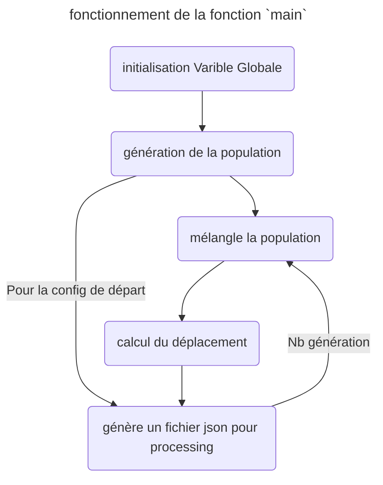

# Exploration de `onlyCPU` 

Donc le but est de faire la même chose que l'objectif mais uniquement sur CPU pour bien comprendre le fonctionnement. De plus on pourra faire de Benchmark de performance de la parallélisation (un petit programme python fera le taff)

## Stucture du programme

Pour mieux comprendre le fonctionnement du programme voici un schéma de son fonctionnement  

