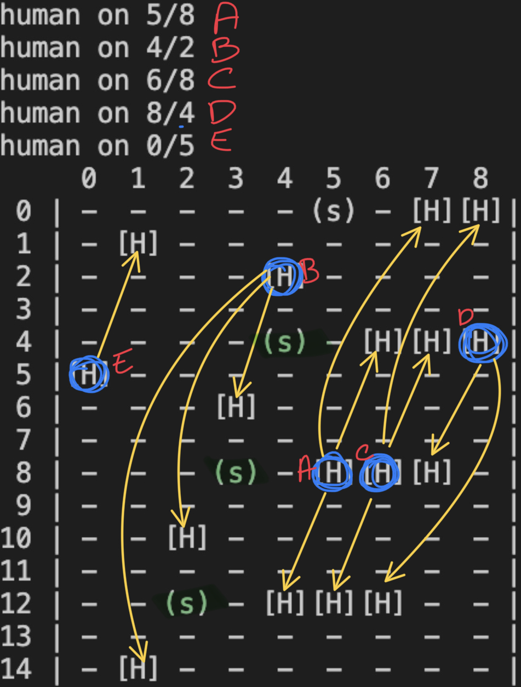
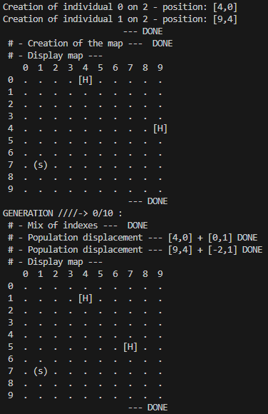

# Exploration de `onlyCPU`

[README.md](../README.md)

Donc le but est de faire la même chose que l'objectif mais uniquement sur CPU pour bien comprendre le fonctionnement. De plus on pourra faire de Benchmark de performance de la parallélisation (un petit programme python fera le taff)

## Table des matières

- [Exploration de `onlyCPU`](#exploration-de-onlycpu)
  - [Table des matières](#table-des-matières)
  - [Stucture du programme](#stucture-du-programme)
  - [Fonction `generatePopulation`](#fonction-generatepopulation)
  - [Fonction `shufflePopulation`](#fonction-shufflepopulation)
  - [Fonction `shifting`](#fonction-shifting)
  - [Fonction `generatesJsonFile`](#fonction-generatesjsonfile)
  - [Fonction `generatesMap`](#fonction-generatesmap)
  - [Fonction `printMap`](#fonction-printmap)
  - [Problèmes dans la code de la fonction `shifting`](#problèmes-dans-la-code-de-la-fonction-shifting)
  - [On ajoute aussi une détéction de Murs simpliste](#on-ajoute-aussi-une-détéction-de-murs-simpliste)

## Stucture du programme

Pour mieux comprendre le fonctionnement du programme voici un schéma de son fonctionnement  


## Fonction `generatePopulation`

La fonction `generatePopulation` prend en paramètre un pointeur vers un tableau 2D de positions, le nombre d'individus souhaité, ainsi que les dimensions de l'espace de simulation. Elle génère de manière aléatoire les positions des individus dans cet espace et les assigne au tableau. Cette fonction effectue également l'allocation et la désallocation de mémoire nécessaire pour le tableau. Enfin, elle peut appeler une fonction de création de fichier JSON pour enregistrer les positions.

Le pointeur sur tab 2D n'as pas besoin d'être instancier en mémoir pour que la fonciton marche. La fonction fait aussi des free memoire pour ne pas avoir de perte de disque.

```c
void generatePopulation(int *** positions,int nbIndividual, int xParam, int yParam){
    /**
     * @brief From a table of position and dimensions of the environment of the simulation, generates the positions of the individuals in a random way in this  space
     * 
     * @param positions     pointer on the table of Vector positions. Does not need to be instantiated in memory
     * @param nbIndividual  The number of individuals that the table must contain
     * @param xParam        dimension in x of the simulation space
     * @param yParam        dimension in y of the simulation space
     */
    ...
}
```

## Fonction `shufflePopulation`

Pourquoi ne pas faire un échange dans un sens puis dans l'autre ? Ne serait-ce pas suffisant ? La méthode `shuffle` de base faite à la main fait le travail dans un premier temps.

La fonction `shuffle` actuelle inverse les positions de 0 à max.

| a   | b   | 0   | 1   | 2   |
| --- | --- | --- | --- | --- |
| 0   | 1   | 1   | 0   | 2   |
| 1   | 1   | 1   | 0   | 2   |
| 2   | 0   | 2   | 0   | 1   |

| a   | b   | 2   | 0   | 1   |
| --- | --- | --- | --- | --- |
| 0   | 1   | 0   | 2   | 1   |
| 1   | 0   | 2   | 0   | 1   |
| 2   | 0   | 1   | 0   | 2   |

Finalement, nous allons mélanger en utilisant un indice de clé à regarder et non en mélangeant les individus du tableau. L'erreur ci-dessus provenait de la méthode utilisée pour inverser deux valeurs. J'essayais de le faire sans créer de nouvelles variables et cela posait problème.

```C
int a = 5;
int b = 10;

a = a + b;
b = a - b;
a = a - b;
```

selon Chat GPT :

>Il existe plusieurs méthodes de mélange algorithmique, voici quelques-unes d'entre elles :
>
>1. Mélange aléatoire (Random Shuffle) : Les éléments sont réarrangés de manière aléatoire en utilisant un générateur de nombres aléatoires.
>2. Algorithme de Fisher-Yates : Aussi appelé mélange aléatoire uniforme, il consiste à parcourir le tableau d'éléments de la fin vers le début et à échanger chaque élément avec un élément sélectionné au hasard parmi les éléments non encore traités.
>3. Mélange de Knuth (Knuth Shuffle) : C'est une variante de l'algorithme de Fisher-Yates qui utilise un générateur de nombres aléatoires pour sélectionner les éléments à échanger.
>4. Mélange de coupe (Cut-and-Shuffle) : Le tableau est divisé en deux parties, puis les deux parties sont mélangées et fusionnées pour former un nouveau mélange.
>5. Mélange par insertion (Insertion Shuffle) : Les éléments sont insérés un par un dans une position aléatoire du tableau.
>
>Ces méthodes de mélange algorithmique sont largement utilisées pour aléatoriser l'ordre des éléments d'un tableau de manière efficace et équitable.

Faudra que je me rensaigne plus efficacement plus tard. Pour l'instant je fait le *Fisher-Yates*. C'est celui qui me semblais le plus naturel.

## Fonction `shifting`

## Fonction `generatesJsonFile`

## Fonction `generatesMap`

## Fonction `printMap`

J'ai un probleme d'affichage dans l'une de ces deux fonctions.

J'ai résolu le problème d'affichage en inversant les axes X et Y, il suffisait de revoir ma logique. Cependant, certaines entités continuent d'apparaître plusieurs fois. Par exemple, la sortie est présente 4 fois, ce qui n'est pas normal.



Lorsque l'on examine attentivement, on constate qu'il y a toujours un décalage de $35$ en mémoire, soit $(4 × 9) - 1$. Cependant, je ne sais pas pourquoi cela se produit. Nous pouvons essayer de modifier les dimensions pour voir s'il y a une évolution potentielle.

En faite c'était la déclaration je resrvais mal la mémoire. et la dimensions de décalge était de 4 lignes c'est du a `sizeof(_element)` qui fait 4

Finalement, j'ai réalisé que le problème était dû à l'utilisation de `malloc`... Franchement, le langage C peut être assez compliqué par moments.

---

## Problèmes dans la code de la fonction `shifting`

Acctuellement j'ai un problème dans le programme de la fonction `shifting`. On constate que le déplacement n'est pas bon (il tente de se déplacer de -2 en x -> impossible)



donc si on reprend les calculs :

$$
Pos_{human} = (9,4) \\
Pos_{exit} = (1,7)
$$

nous avons dans notre fonction fais les calculs suivant :

$$
\Delta x = Pos_{exit}.x - Pos_{human}.x\\
\Delta y = Pos_{exit}.y - Pos_{human}.y
$$
$$
déplacement.x = \frac{\Delta x}{max(\Delta x,\Delta y)}\\
déplacement.y = \frac{\Delta y}{max(\Delta x,\Delta y)}
$$

donc problème avec les positions c'est que le max s'en fiche des valeurs négative.

Un autre problème c'est que le veteur de déplacement n'est pas droit/ constant. Comme il est recalculer à toutes les frames. du coup j'ai passer toutes les positions en float pour ne plus avoir le problème.

## On ajoute aussi une détéction de Murs simpliste

Si on se déplace sur un mure on test si un autre case au pif et libre et si oui on y vas. Sinon on fait rien.
