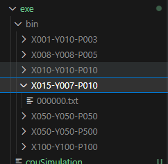

# version CPU

## Compilation

Copiez intégralement le contenu du fichier `CMakeLists.txt` avec le code suivant :

```cmake
cmake_minimum_required(VERSION 3.0)
project(GPUSimulation VERSION 0.1.0 LANGUAGES CXX)

# Spécifier les fichiers source
set(SOURCES
    src/cpu/onlyCPU.cpp
)

# Spécifier les fichiers d'en-tête
set(HEADERS
)

# Spécifier le répertoire de sortie pour l'exécutable
set(EXECUTABLE_OUTPUT_PATH ${CMAKE_CURRENT_SOURCE_DIR}/exe)

# Compiler les fichiers source avec g++
add_executable(cpuSimulation ${SOURCES} ${HEADERS})
```

Ensuite, à la racine du projet, exécutez les commandes suivantes :

```bash
~ cmake .
~ make
```

Une fois compilé sans erreur, vous pouvez exécuter le programme avec la commande suivante :

```bash
~./exe/cpuSimulation
```

Assurez-vous de vous trouver dans le répertoire racine du projet lors de l'exécution des commandes.

## Utilisation

Voici la description des différents paramètres :

- `-x` : Définit la dimension en x de la simulation.
- `-y` : Définit la dimension en y de la simulation.
- `-p` : Nombre d'individus dans la simulation.
- `-gen` : Nombre de génération/frame.
- `-debug` : Affiche toutes les commandes de débogage (`'on'` pour activer, `'off'` pour désactiver, valeur par défaut : `'off'`).
- `-map` : Affiche la génération de la carte (`'on'` pour activer, `'off'` pour désactiver, valeur par défaut : `'on'`).
- `-export` : Exporte chaque frame au format txt (`'on'` pour activer, `'off'` pour désactiver, valeur par défaut : `'on'`).
- `-dir` : Spécifie le répertoire d'exportation des fichiers. Par défaut : `'../exe/bin/'`.
- `-help -h` : Affiche l'aide du programme.

Ces paramètres vous permettent de contrôler différents aspects de la simulation de foule sur une grille. Vous pouvez définir les dimensions de la grille, le nombre d'individus, le nombre de génération, activer ou désactiver l'affichage de débogage et de la carte générée, exporter les frames au format txt, et spécifier le répertoire d'exportation. En cas de besoin, vous pouvez également afficher l'aide pour obtenir plus d'informations sur les paramètres.

par exemple la commande :

```bash
~./exe/cpuSimulation -x 15 -y 7 -gen 1 -p 10
 > Parameters : [15,7,1,10]
 >     0  1  2  3  4  5  6  7  8  9 10 11 12 13 14
 >  0 [H][H] .  .  .  .  .  .  . [H] .  .  .  .  .
 >  1  .  . (s) . [H] . [H][H] .  .  .  .  .  .  .
 >  2  .  .  .  .  .  .  .  .  .  .  .  .  .  .  .
 >  3  .  .  .  .  .  .  .  .  .  .  .  .  .  .  .
 >  4  .  . [H][H] .  .  .  .  .  .  .  .  . [H] .
 >  5  .  .  .  .  .  .  .  .  .  .  .  .  .  .  .
 >  6  .  .  .  . [H] .  .  .  .  .  .  .  .  .  .
 > 
 > Generation -> 0/1 :
 >     0  1  2  3  4  5  6  7  8  9 10 11 12 13 14
 >  0 [H] .  .  .  .  .  .  . [H] .  .  .  .  .  .
 >  1  .  . (s)[H] . [H] . [H] .  .  .  .  .  .  .
 >  2  .  .  .  .  .  .  .  .  .  .  .  .  .  .  .
 >  3  .  . [H] .  .  .  .  .  .  .  .  . [H] .  .
 >  4  .  .  . [H] .  .  .  .  .  .  .  .  .  .  .
 >  5  .  .  . [H] .  .  .  .  .  .  .  .  .  .  .
 >  6  .  .  .  .  .  .  .  .  .  .  .  .  .  .  .
```

Dans l'exemple précédent, le programme `cpuSimulation` a été exécuté avec les paramètres suivants :

- Dimension en x de la simulation : 15
- Dimension en y de la simulation : 7
- Nombre total de générations : 1
- Nombre d'individus : 10

Le résultat affiché représente l'état de la grille après l'initialisation et la première génération de la simulation. Voici l'interprétation :

- `[H]` : Indique la présence d'un humain à cet emplacement de la grille.
- `(s)` : Indique la position de la sortie de la simulation.
- `.` : Indique une case vide.

En observant la grille, on peut voir la position des humains et de la sortie. Cela permet de comprendre comment les humains se déplacent dans la simulation et comment ils peuvent atteindre la sortie.

De plus un dossier est créer et contient toutes les étapes de la simulation au format `.txt`. Le nom du dossier sont les paramètres de la simulation en X Y et P. Il est rangé comme suivant :



## Contenue du dossier

Voici le contenu du dossier de mon travail :

1. Readme : Ce fichier contient des informations comme des instructions d'utilisation, des explications sur les fonctionnalités et les paramètres du programme, ainsi que d'autres détails importants.
2. Programme CPP : Ce fichier contient le code source principal du programme de simulation de foule sur une grille. Il met en œuvre diverses fonctionnalités, telles que le déplacement des individus, la gestion des générations et l'affichage d'une carte en vue de dessus.
3. Fichier IPYNB : À un moment donné, j'ai envisagé d'utiliser un notebook Jupyter pour effectuer des tests de performance sur mon programme. Cependant, ce fichier n'a pas été utilisé car j'ai décidé de me concentrer sur l'essenciel. Il peut contenir des expérimentations, des analyses ou des visualisations de données liées à la simulation de foule.

Pour utiliser le code Jupyter inclus dans le projet, vous devez installer les éléments nécessaires sur votre machine. Aucun environnement virtuel (Venv) n'est fourni, ce qui signifie que vous devrez configurer votre environnement Jupyter vous-même.

Voici les étapes recommandées pour installer les dépendances nécessaires :

1. Assurez-vous d'avoir Python installé sur votre machine. Vous pouvez vérifier cela en exécutant la commande `python --version` dans votre terminal. Si Python n'est pas installé, veuillez le télécharger et l'installer à partir du site officiel de Python.

2. Installez Jupyter Notebook en utilisant la commande suivante :
   ```bash
   pip install jupyter
   ```

3. Une fois Jupyter installé, accédez au répertoire contenant le fichier IPYNB inclus dans le projet.

4. Lancez Jupyter Notebook en exécutant la commande suivante :
   ```bash
   jupyter notebook
   ```

5. Cela ouvrira une interface Jupyter Notebook dans votre navigateur par défaut. Naviguez jusqu'au fichier IPYNB et cliquez dessus pour l'ouvrir.

Maintenant, vous devriez pouvoir exécuter le code Jupyter et interagir avec le notebook pour effectuer des tests de performance ou toute autre analyse souhaitée.

Veuillez noter que ces instructions supposent que vous disposez déjà d'un environnement Python fonctionnel sur votre machine. Si ce n'est pas le cas, veuillez installer Python en utilisant la méthode appropriée pour votre système d'exploitation avant de suivre les étapes ci-dessus.